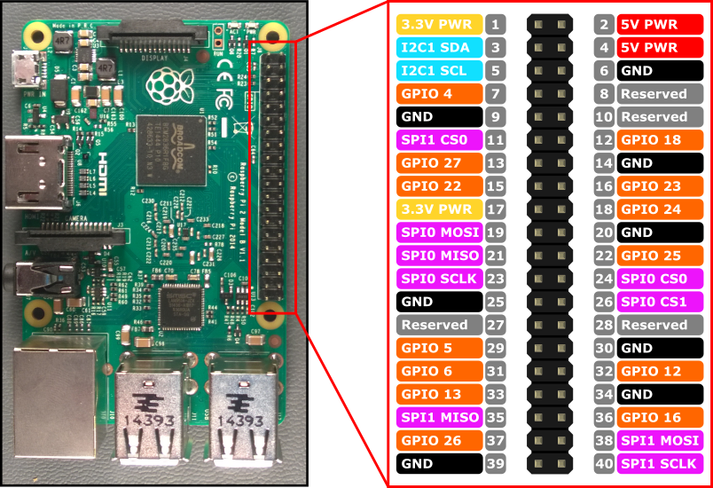

# 2018_URC

## Raspberry Pi 3 Pinout

## GPS Module (Sparkfun Venus)
RPI -> GPS  
RX -> TX  
GND -> GND  
3.3V -> 3.3V  

## IMU Module (MPU-92/65)
RPI -> IMU  
3.3V -> VCC  
GND -> GND  
SCL -> SCL  
SDA -> SDA  
